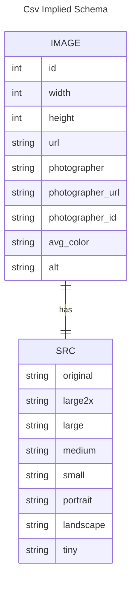
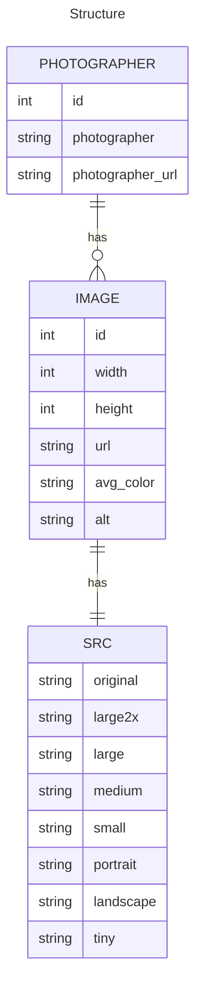

# Schema
## CSV

```mermaid
---
title: Csv Implied Schema
---
erDiagram
IMAGE {
    int id
    int width
    int height
    string url
    string photographer
    string photographer_url
    string photographer_id
    string avg_color
    string alt
}
SRC {
    string original
    string large2x
    string large
    string medium
    string small
    string portrait
    string landscape
    string tiny
}
IMAGE ||--|| SRC: has
```

## API Structure

```mermaid
---
title: Structure
---
erDiagram
IMAGE {
    int id
    int width
    int height
    string url
    string avg_color
    string alt
}
PHOTOGRAPHER {
    int id
    string photographer
    string photographer_url
}
SRC {
    string original
    string large2x
    string large
    string medium
    string small
    string portrait
    string landscape
    string tiny
}
PHOTOGRAPHER ||--o{ IMAGE : has
IMAGE ||--|| SRC : has
```